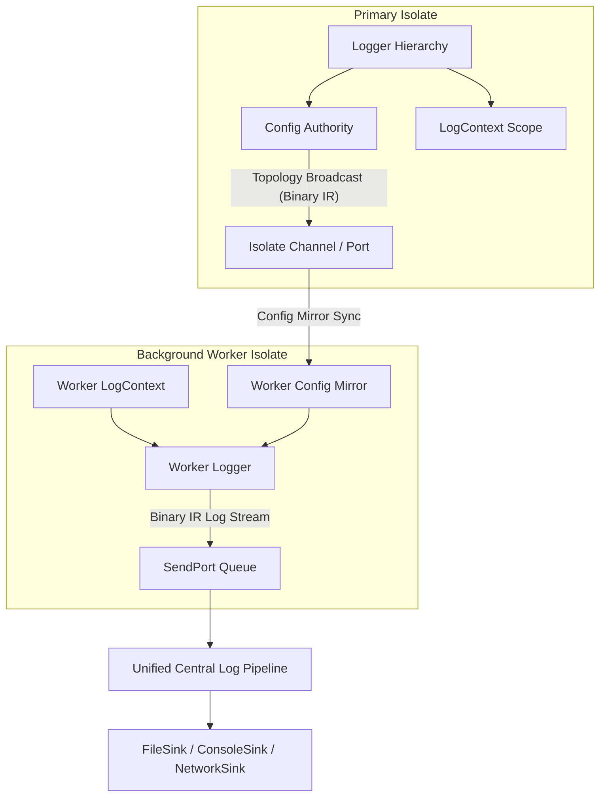

# logd Isolate Model — Architecture & Structural Analysis
> Author: System Architecture Analysis | Date: 2026-08-19

---

## 1. Executive Summary & The Structural Gap

`logd` was originally designed as a high-throughput, in-process, allocation-minimized logging engine. Its internal components (`Logger` namespace tree, `LoggerCache`, `Arena` LIFO pool, `LoggerSerializationRegistry`, `LogContext`) are instantiated as **process-local singletons within an isolate's private heap**.

When developers introduce multi-isolate architectures (such as `Isolate.spawn()`, Flutter background workers, or Dart Frog server clusters), each isolate possesses completely distinct instances of these objects:
- `Logger.get('app.database')` in Isolate A and `Logger.get('app.database')` in Isolate B are entirely independent objects.
- `Logger.configure()` executed in the main isolate has zero effect on background workers unless manually serialized and passed via `SendPort`.
- `LogContext.run({'requestId': 'req-123'}, ...)` relies on Dart `Zone`s, which are strictly isolated per thread/isolate and do not propagate across `Isolate.spawn()` boundaries.

Attempting to solve this with a lightweight pub/sub bus (`LogdIsolateHub`) is an **immature patch on top of patches**: it introduces race conditions, partial cache invalidation hazards, and message ordering ambiguities without resolving the underlying architectural ambiguity.

---

## 2. Core Architectural Challenges

### Challenge A: Configuration Authority & Drift
In an isolate hierarchy, who is the source of truth for logger configuration?
1. **Centralized (Primary-Owned)**: The primary isolate is the single authority. All background isolates are read-only mirrors. If a worker calls `Logger.configure()`, it throws an error or forwards a mutation request to the primary.
2. **Decentralized / Autonomous**: Each isolate can customize its own log level (e.g. background data worker logs at `LogLevel.warn`, primary UI logs at `LogLevel.debug`), with optional fallback inheritance from a shared bootstrap config.

Currently, `logd` has neither: workers silently mutate their local config, causing silent divergence between isolates with no notification or deterministic reconciliation.

### Challenge B: Memory Boundaries vs. Ambient MDC Propagation
`LogContext` uses Dart `Zone` values for zero-allocation propagation through synchronous and asynchronous execution paths. However:
- Zones are tied to the local event loop of an isolate.
- Background workers spawned to process CPU-intensive tasks lose all active ambient MDC metadata unless explicitly packed into the worker input data and manually unpacked via `LogContext.run(...)` inside the isolate entrypoint.

A principled multi-isolate logging architecture must provide ergonomic hooks (e.g. `IsolateRunner` wrappers or `LogContext.wrapCallback`) to serialize and restore ambient context across isolate boundaries.

### Challenge C: In-Flight Crash Safety & Packet Loss
`NativeIsolateSink` provides auto-recovery (respawning workers after a 2-second backoff if they crash). However:
- Packets queued in the dying isolate's in-memory mailbox are permanently lost.
- There is no backpressure or acknowledgment handshake between the producer isolate and consumer sink isolate.

### Challenge D: Multi-Isolate Trace & Span Correlation
In enterprise multi-isolate topologies:
- An HTTP request enters the primary isolate (`traceId: T1`, `spanId: S1`).
- Heavy JSON parsing or image compression is dispatched to Worker Isolate 3 (`spanId: S2`, `parentSpanId: S1`).
- Log lines emitted by Worker 3 have no intrinsic correlation to `T1` unless manual log parameters are threaded.

---

## 3. Principled Multi-Isolate Architecture Requirements (v0.10.x Vision)

A mature multi-isolate architecture for `logd` (targeting the `v0.10.x` series ahead of `v1.0.0`) requires:

1. **Explicit Topology Declaration**: Formally register isolate roles (`LogdIsolateRole.primary`, `LogdIsolateRole.worker`) during initialization.
2. **Deterministic Configuration Protocol**: Binary-encoded, version-stamped configuration messages broadcast from the authority isolate to worker mirrors.
3. **Cross-Isolate Context Bridges**: Standard helpers to wrap isolate entrypoints with ambient context serialization and restoration.
4. **Unified Ingestion Stream**: Worker isolates forward structured binary packets to a dedicated logging coordinator isolate or the primary sink pipeline to prevent interleaving and lock contention on physical I/O resources (files, sockets).
