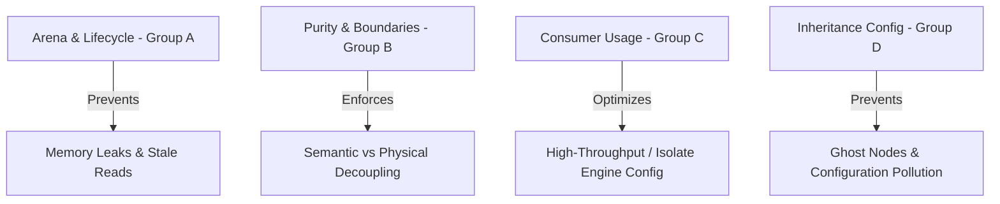

# Logd Linters: Architecture, Principles & Roadmap

Surfaces `logd` API contracts, arena lifecycle constraints, and formatting purity constraints directly inside the analyzer via `custom_lint`.

---

## 1. Core Principles & Philosophy

The rules are divided into four logical layers mirroring the `logd` core boundaries defined in `architectural-integrity.md`:



### Decoupling Rules
1. **Semantic vs Physical Boundary:** Formatters and decorators operate strictly on the **Semantic IR** (`LogDocument`). Terminal layout and formatting (e.g. wrapping, colors, column configurations) must be delegated to `TerminalLayout` (Physical Layer). No rule should allow direct console or `stdout`/`stderr` interaction inside formatters/decorators.
2. **Statelessness & Immutability:** Formatters and decorators must be `@immutable` and stateless. Under isolate-based logging, these instances are shared across worker isolates; mutable state creates severe data races.

---

## 2. AST Visitor & Scoping Strategies

To minimize false positives while accurately checking lifecycle bounds, several advanced AST visitor patterns are established:

### Lexical Scope Stack
Rules like `logd_checkout_without_release` require matching document checkouts with their release calls. 
- **The Scoping Bug:** Listening simply to `addVariableDeclaration` and `addFunctionBody` entries in a single flat map triggers false positives in nested blocks/closures (e.g., helper functions or `forEach` literals), because exiting *any* function body clears the registry.
- **The Scope Stack Solution:** Implemented via a custom `RecursiveAstVisitor` that manages a stack of scopes (`List<Map<String, MethodInvocation>>`).
  - Entering `visitBlockFunctionBody` or `visitExpressionFunctionBody` pushes a new scope map to the stack.
  - Variable checkouts are registered to the innermost active scope.
  - Method invocations of `release` or `releaseRecursive` look from the innermost scope outwards to remove active checkouts.
  - Exiting the function body pops the innermost scope and reports any remaining (unreleased) checkouts.

### Left-Hand-Side Assignment Resolution
In analyzer 8.x, simple identifiers on the LHS of assignments do not resolve their `element` directly (it returns `null`).
- To correctly detect field assignments (e.g., `_lastDoc = document` retaining documents across log cycles), resolve the element using `node.writeElement ?? left.element`.
- Extract underlying field definitions by resolving `PropertyAccessorElement` to its inducing variable (`element.variable`).

### Intervening Statement Configuration Matching
To distinguish between configured logger freezing and "ghost logger" freezing in `logd_freeze_on_unconfigured_logger`:
- Access the enclosing block statement chain.
- Look back at all preceding statements within the same block.
- Inspect if any statement is a static invocation of `Logger.configure(name, ...)` matching the name of the logger being frozen.

---

## 3. The Integration Testing Harness

Standard `dart test` executions containing empty `void main() {}` loops do not execute custom linter logic. Rule verification must be run in a dedicated consumer package (`packages/logd_linters/example/`).

### Test Setup Checklist
1. **Dependencies:**
   ```yaml
   dev_dependencies:
     custom_lint: ^0.8.1
     logd_linters:
       path: ../
   ```
2. **Analysis Options (`analysis_options.yaml`):**
   ```yaml
   analyzer:
     plugins:
       - custom_lint
   ```
3. **Comment Directives:** Write code with expected violations marked with `// expect_lint: rule_name` on the preceding line.
4. **Execution:**
   ```bash
   dart run custom_lint
   ```

---

## 4. Roadmap & Future Extensions

### Custom Quick-Fixes (DartFix)
Only 4 out of the 12 rules currently have quick-fixes. Future releases will implement the remaining 8:
*   **`logd_metadata_set_duplicate`**: Removes duplicate metadata items from set literals.
*   **`logd_missing_release_in_engine`**: Automatically wraps pipeline body inside `try-finally` and calls `releaseRecursive`.
*   **`logd_decorator_not_immutable` & `logd_formatter_not_immutable`**: Adds `@immutable` and converts fields to `final`.

### Workspace Enforcement
Every package in the workspace should have `custom_lint` integrated to ensure developers maintain strict pipeline decoupling as the engine grows.
