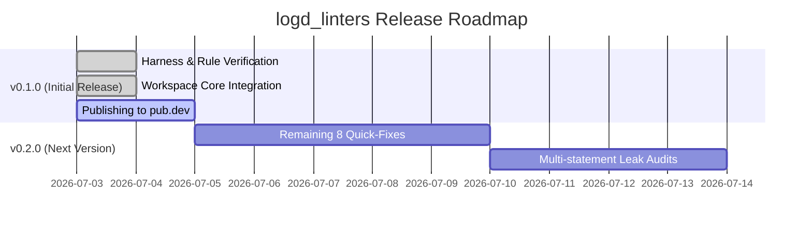

# Logd Linters: Publishing & Release Roadmap

This document outlines the scope of the **v0.1.0** first release, the deferred features for **v0.2.0**, and the step-by-step checklist to safely publish the package to pub.dev.

---

## 1. Release Milestones



### v0.1.0 — Initial Release (Current RC)
*   **Goal:** Core stability and workspace-wide validation of the 12 rule AST contracts.
*   **Scope:** 
    *   12 rules covering Arena Lifecycle, Purity Boundaries, Engine Usage, and Inheritance Hierarchy.
    *   Full validation via the `example/` package integration tests.
    *   4 initial `DartFix` quick-fixes.
*   **Status:** Feature-complete, tested, and verified clean on the core package. Ready for merge and publish.

### v0.2.0 — Quick-Fixes & Precision (Incoming Version)
*   **Goal:** Enhance developer experience (DX) and extend leak resolution scope.
*   **Scope:**
    *   **Quick-Fixes (DartFix):**
        *   `logd_metadata_set_duplicate`: Deduplicate set literal.
        *   `logd_missing_release_in_engine`: Wrap body in `try-finally` and insert `releaseRecursive`.
        *   `logd_decorator_not_immutable` & `logd_formatter_not_immutable`: Pre-pend `@immutable` annotation and fix non-final fields.
    *   **Leak Precision:** Upgrade `CheckoutWithoutRelease` to trace multi-statement checkout/releases across helper variables.

---

## 2. Publishing Checklist

Because `logd` (core) and `logd_linters` reside in a mono-repo, they must be published sequentially. **Pub.dev forbids publishing packages with local path dependencies (even in `dev_dependencies`).**

### Step 1: Pre-publish Verification
Before publishing, ensure the package passes all pub validation checks.
Run these commands in `packages/logd_linters`:
```bash
# Verify analysis and formatting
dart analyze .
dart format --output=none --set-exit-if-changed .

# Perform pub dry-run validation
dart pub publish --dry-run
```

### Step 2: Publish `logd_linters`
Publish `logd_linters` to pub.dev first:
```bash
cd packages/logd_linters
dart pub publish
```

### Step 3: Align Core `logd` Dependencies
Once `logd_linters` is live on pub.dev, update the core `logd` package's references to decouple it from local paths.
In `packages/logd/pubspec.yaml`:
```diff
 dev_dependencies:
   custom_lint: ^0.8.1
   logd_linters:
-    path: ../logd_linters
+    ^0.1.0
```
Verify the core package works with the hosted linter:
```bash
cd packages/logd
dart pub get
dart run custom_lint
```

### Step 4: Pull Request, CI, and Dev Integration
All feature work must go through the integration branch (`dev`) before production release:
1. **Push the feature branch:**
   ```bash
   git push origin feat/logd-linters
   ```
2. **Create a Feature PR:** Open a Pull Request on GitHub from `feat/logd-linters` targeting the `dev` branch.
3. **Verify CI & Code Review:** Wait for the workspace checks on `dev` to complete successfully and obtain approval.
4. **Merge to Dev:** Merge the PR (squash/merge) into `dev`.

### Step 5: Release Candidate & Production Merge
Once `dev` contains a stable release candidate ready for deployment:
1. **Verify Dry-Run on dev:** Align and verify all dependencies in the `dev` branch:
   ```bash
   git checkout dev
   git pull origin dev
   # Dry-run publish
   cd packages/logd_linters && dart pub publish --dry-run
   ```
2. **Create a Release PR:** Open a Pull Request from `dev` targeting the `master` branch.
3. **Verify Production CI:** Wait for final validation checks on `master`.
4. **Merge to Master:** Squash/merge `dev` into `master`.
5. **Sync & Tag:**
   ```bash
   git checkout master
   git pull origin master
   git tag -a v0.1.0 -m "Release logd_linters v0.1.0"
   git push origin v0.1.0
   ```
6. **Publish:** Run `dart pub publish` in the target package directories from the clean `master` branch.
