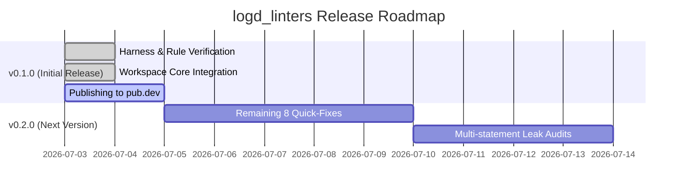

# Logd Linters: Publishing & Release Roadmap

This document outlines the scope of the **v0.1.0** first release, the deferred features for **v0.2.0**, and the step-by-step checklist to safely publish the package to pub.dev.

---

## 1. Release Milestones



### v0.1.0 — Initial Release (Current RC)
*   **Goal:** Core stability and workspace-wide validation of the 12 rule AST contracts.
*   **Scope:** 
    *   12 rules covering Arena Lifecycle, Purity Boundaries, Engine Usage, and Inheritance Hierarchy.
    *   Full validation via the `example/` package integration tests.
    *   4 initial `DartFix` quick-fixes.
*   **Status:** Feature-complete, tested, and verified clean on the core package. Ready for merge and publish.

### v0.2.0 — Quick-Fixes & Precision (Incoming Version)
*   **Goal:** Enhance developer experience (DX) and extend leak resolution scope.
*   **Scope:**
    *   **Quick-Fixes (DartFix):**
        *   `logd_metadata_set_duplicate`: Deduplicate set literal.
        *   `logd_missing_release_in_engine`: Wrap body in `try-finally` and insert `releaseRecursive`.
        *   `logd_decorator_not_immutable` & `logd_formatter_not_immutable`: Pre-pend `@immutable` annotation and fix non-final fields.
    *   **Leak Precision:** Upgrade `CheckoutWithoutRelease` to trace multi-statement checkout/releases across helper variables.

---

## 2. Publishing Checklist

Because `logd` (core) and `logd_linters` reside in a mono-repo, they must be published sequentially. **Pub.dev forbids publishing packages with local path dependencies (even in `dev_dependencies`).**

### Step 1: Pre-publish Verification
Before publishing, ensure the package passes all pub validation checks.
Run these commands in `packages/logd_linters`:
```bash
# Verify analysis and formatting
dart analyze .
dart format --output=none --set-exit-if-changed .

# Perform pub dry-run validation
dart pub publish --dry-run
```

### Step 2: Publish `logd_linters`
Publish `logd_linters` to pub.dev first:
```bash
cd packages/logd_linters
dart pub publish
```

### Step 3: Align Core `logd` Dependencies
Once `logd_linters` is live on pub.dev, update the core `logd` package's references to decouple it from local paths.
In `packages/logd/pubspec.yaml`:
```diff
 dev_dependencies:
   custom_lint: ^0.8.1
   logd_linters:
-    path: ../logd_linters
+    ^0.1.0
```
Verify the core package works with the hosted linter:
```bash
cd packages/logd
dart pub get
dart run custom_lint
```

### Step 4: Pull Request, CI, and Merge
Once verified:
1. **Push the branch:**
   ```bash
   git push origin feat/logd-linters
   ```
2. **Create a Pull Request (PR):** Open a PR on GitHub from `feat/logd-linters` targeting `master`.
3. **Verify CI:** Wait for the GitHub Actions workspace analysis and tests to complete successfully.
4. **Merge:** Merge the PR via the GitHub interface (squash/merge).
5. **Sync local master:**
   ```bash
   git checkout master
   git pull origin master
   ```
6. **Tag & Release:** Tag the release branch and optionally publish the next version of `logd` (incorporating the built-in linter configuration).
