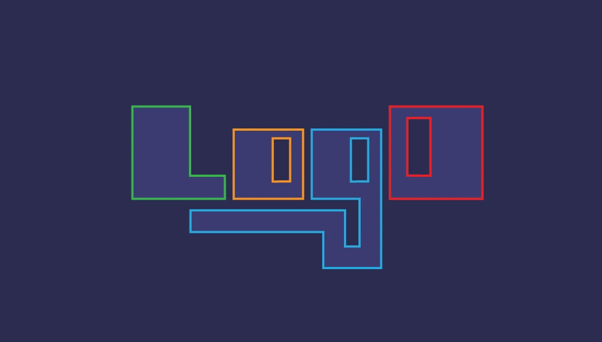

<h1 style="margin-bottom: 20px; text-align: left;font-weight: bold; width:" > logd Monorepo    </h1>





<p style="width: 100%; margin-bottom: 30px; text-align: left; font-weight: normal; font-size: 18px;">Welcome to the <b>logd</b> monorepo. This workspace contains the core <b>logd</b> library, performance benchmarks, and shared development scripts.</p>


## Project Structure

This project is organized as a **Native Dart Workspace** managed with [Melos](https://melos.invertase.dev/).

- **[packages/logd](packages/logd)**: The core hierarchical logging engine.
- **[doc/](doc)**: Deep-dive technical documentation (Philosophy, Architecture, Roadmaps).
- **[scripts/](scripts)**: Infrastructure for testing and network logging simulations.
- **[example/](packages/logd/example)**: Comprehensive tutorial and usage showcases.

## Development Guide

### Prerequisites

Ensure you have the Dart SDK (3.6.0+) and [Melos](https://pub.dev/packages/melos) installed:

```bash
dart pub global activate melos
```

### Common Commands

We use Melos to orchestrate tasks across the workspace:

| Command | Description |
|---------|-------------|
| `melos bootstrap` | Initialize the workspace and link packages |
| `melos run test` | Run all unit and integration tests |
| `melos run get` | Run `pub get` in all packages |
| `melos clean` | Clean build artifacts and dependencies |

### Running the Showcase

The definitive tutorial-style example is located in the core package:

```bash
dart run packages/logd/example/main.dart
```

## Documentation Source of Truth

Technical depth is maintained in the root `/doc` directory:

- [**Documentation Index**](doc/README.md)
- [**Design Philosophy**](doc/logger/philosophy.md)
- [**Architecture Overview**](doc/logger/architecture.md)

## Contributing

Please read our [Contributing Guidelines](CONTRIBUTING.md) and [Documentation Standards](doc/CONTRIBUTING_DOCS.md) before submitting pull requests.

## License

All packages in this monorepo are licensed under the **BSD 3-Clause License**. See the [LICENSE](LICENSE) file for details.
