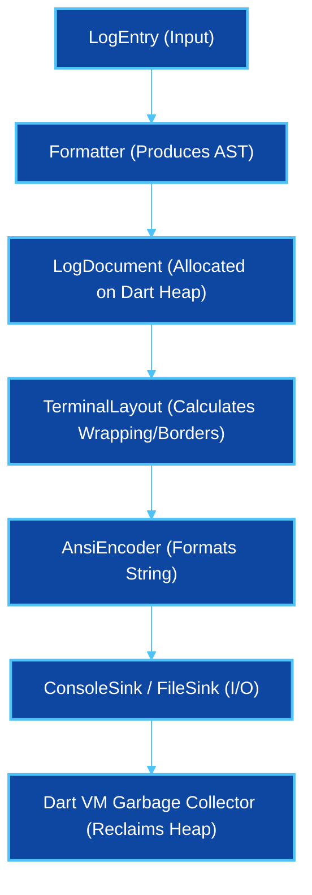
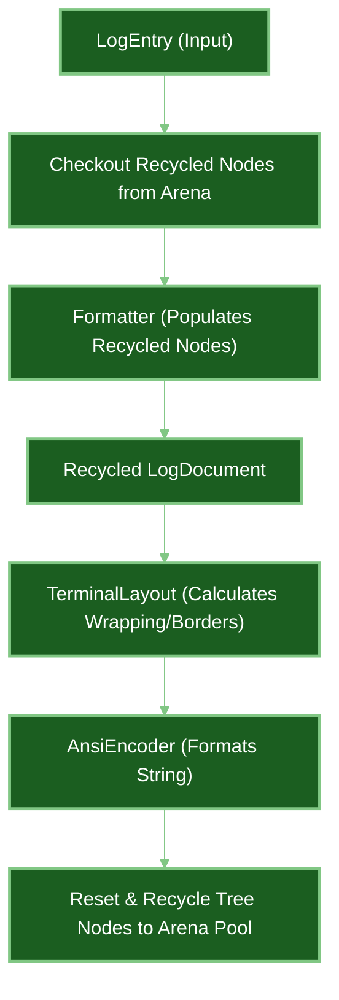
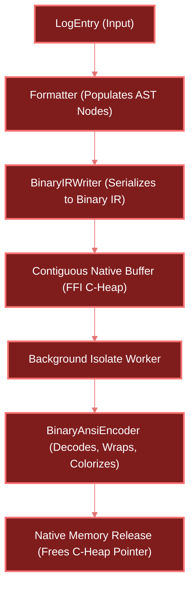

# Logd Engine Stability & Performance Report

An architectural assessment and performance profiling of the three core log execution engines in `logd`: **Standard**, **Arena**, and **Native (FFI)**.

---

## 1. Engine Architecture & Memory Lifecycles

### I. Standard Engine (Managed GC)
> Focuses on simplicity and ease of debugging. Every log cycle relies on the Dart VM garbage collector.



---

### II. Arena Engine (Object Pool)
> Focuses on zero main-thread allocations. Reuses memory using an isolate-local LIFO pool.



---

### III. Native Engine (FFI / Isolate Offload)
> Focuses on maximum throughput. Offloads formatting, wrapping, and I/O to background C/Isolate layers.



---

## 2. Engine Scorecard

| Metric | `StandardEngine` | `ArenaEngine` | `NativeEngine` |
| :--- | :---: | :---: | :---: |
| **Stability** | 🟢 **Excellent** | 🟡 **High** | 🔴 **Medium / Low** |
| **Memory Model** | Managed VM Heap | LIFO Object Pool | Raw Native Pointers |
| **Memory Safety** | 100% Guaranteed | Pool Contract Dependant | Vulnerable to FFI Offsets |
| **Layout Parity** | 100% (Primary Path) | 100% (Primary Path) | Fragile (Separate C-Parser) |
| **GC Pressure** | High Churn | **Zero Churn** | **Zero Churn** |
| **Portability** | Universal | Universal | Requires Native Bindings |

---

## 3. Real-Time Performance Benchmarks
*Profiled using Dart SDK 3.12.0 on Linux x64 over 10,000 iterations per scenario.*

### Scenario 1: Raw Machine (JSON)
> High-density, machine-parseable serialization.

```
Standard  ██████████████  14,155 ops/sec (97.0µs)
Arena     ████████████████████  20,265 ops/sec (63.0µs)
Native    ███████████████████████  23,114 ops/sec (64.0µs) [FASTEST]
```

### Scenario 2: Modern Human (Structured + Box)
> Multi-line layout styling with box borders.

```
Standard  ██████████████  9,397 ops/sec (143.0µs)
Arena     ███████████████  10,299 ops/sec (124.0µs)
Native    ████████████████████  13,284 ops/sec (104.0µs) [FASTEST]
```

### Scenario 3: Framing Squeeze (Prefix + Box @ 40 width)
> Heavy word-wrapping and line slicing under tight width boundaries.

```
Standard  █████████  4,670 ops/sec (280.0µs)
Arena     ██████████  4,931 ops/sec (249.0µs)
Native    ██████████████████████████  12,747 ops/sec (100.0µs) [2.7x FASTEST]
```

### Scenario 4: Complex Native (TOON + Box + Nesting)
> Structured columns with decorators triggering compatibility fallback.

```
Standard  ███████████  5,248 ops/sec (231.0µs)
Arena     ████████████  5,570 ops/sec (211.0µs) [FASTEST]
Native    █████████  4,399 ops/sec (320.0µs)
```

---

## 4. Key Performance Takeaways

> [!TIP]
> **The Word-Wrapping Breakthrough (Scenario 3)**
> When terminal widths are constrained (e.g. 40 columns), word-wrapping on the Dart heap generates thousands of short-lived string allocations. By processing text wrapping and alignment at the raw byte/pointer level, `NativeEngine` runs **2.7x faster** than the Standard Engine.

> [!WARNING]
> **The Compatibility Penalty (Scenario 4)**
> Custom serialization formats (like TOON) cannot be processed natively by `BinaryAnsiEncoder`. This forces `NativeEngine` to trigger an engine fallback, causing a double-formatting overhead that drops throughput **below heap-allocation levels** (4.3k ops/sec vs 5.5k ops/sec).

---

## 5. Architectural Recommendations

1. **StandardEngine is the Universal Default**:
   * Out-of-the-box compatibility across Web, Desktop, Mobile, and CLI. Fully guarantees layout parity with zero platform bindings.
2. **Opt into `ArenaEngine` for High-Throughput VM/Flutter Applications**:
   * It provides 100% layout fidelity guarantees and eliminates GC pressure on the Dart thread by using a LIFO recycler pool.
3. **Isolate `NativeEngine` for Pure Performance CLI Pipelines**:
   * Restrict `NativeEngine` to standard human/JSON CLI profiles on VM. Do not mix FFI-offloading with complex structured text protocols (TOON/Markdown) to avoid double-formatting fallback rendering degradation.
