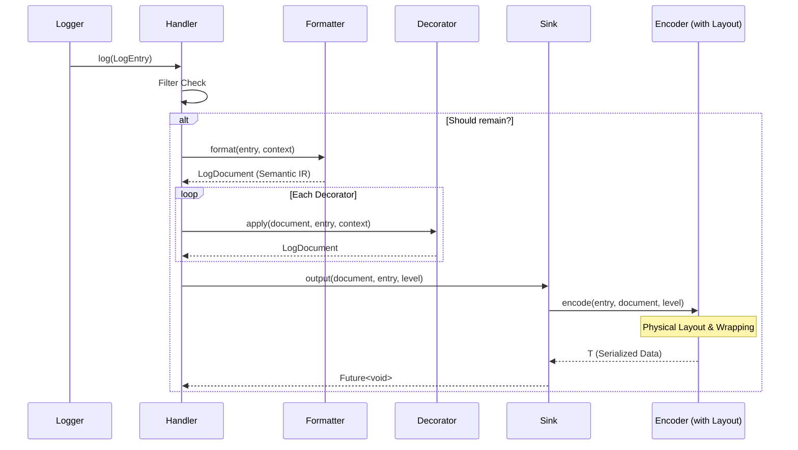

# Handler Architecture

This document details the internal processing pipeline of the `Handler` module.

## The Pipeline

The `Handler` class acts as an orchestrator. When `handler.log(entry)` is called, data flows through five distinct stages.

### The Life of a Log entry (Sequence)

The `Handler` initializes a `LogContext` for every entry, ensuring **Unified Layout Sovereignty**:
- **totalWidth**: The authoritative spatial limit (from sink or user).
- **paddingWidth**: Calculated as the sum of all structural decorator footprints.
- **availableWidth**: The remaining slot for initial content (`totalWidth - paddingWidth`).

Wrapping is no longer a top-level stage in the `Handler`. Instead, it is deferred to the **Encoding** phase, where the `LogEncoder` (typically using `TerminalLayout`) calculates the final physical geometry based on the `LogDocument` and the `totalWidth`. This ensures that wrapping happens with full knowledge of the target medium's constraints.

### Stage 1: Filtering
**Component**: `LogFilter`
**Input**: `LogEntry`
**Output**: `Boolean`

Filters are deeply efficient checks run before any string manipulation occurs. If any filter returns `false`, processing stops immediately to save CPU cycles.
- *Example*: `LevelFilter` (ignore DEBUG logs), `RegexFilter` (ignore logs containing "password").

### Stage 2: Formatting (Semantic Literacy)
**Component**: `LogFormatter`
**Input**: `LogEntry`, `LogContext`
**Output**: `LogDocument` (Semantic Intermediate Representation)
 
The formatter transforms the structured log entry into a semantic `LogDocument`. This document contains a sequence of `LogNode`s (like `MessageNode`, `MapNode`, or `ListNode`) that carry the "intent" of the log without being tied to a specific physical representation.

- **Semantic IR**: Formatters like `JsonFormatter` and `ToonFormatter` no longer emit raw strings. They emit `MapNode`s containing the raw data, allowing specialized encoders to handle the physical serialization.
- **Geometric Agnosticism**: Most formatters are now width-agnostic. They structure logs into semantic nodes (headers, messages, data blocks), delegating the final word-wrapping and alignment to the layout engine during encoding.
- **StructuredFormatter**: Detailed layout (header, origin, message) with fine-grained semantic tagging. **(Best for Console)**
- **ToonFormatter**: Produces a `MapNode` with TOON-specific metadata. **(Best for LLM/Streaming)**
- **JsonFormatter**: Produces a `MapNode` for pure structured logging. **(Best for HTTP/Storage)**
- **JsonPrettyFormatter**: Produces a `MapNode` tagged for recursive, styled JSON inspection.
- **MarkdownFormatter**: Generates structured Markdown nodes (headers, lists, collapsible blocks).
- **PlainFormatter**: Streamlined semantic nodes for simple text output.

### Semantic Tagging (`LogTag`)

The bridge between Stage 2 (Formatting) and Stage 3 (Decoration) is the `LogTag`. Formatters do not emit raw strings; they emit `LogSegment`s tagged with semantic metadata.

| Tag | Purpose | Example Component                     |
|---|---|---------------------------------------|
| `header` | General structural metadata | `ToonFormatter` fields                |
| `timestamp` | Time of entry | `StructuredFormatter`                 |
| `level` | Log severity (e.g. `[INFO]`) | `StructuredFormatter`                 |
| `message` | The primary content | `JsonFormatter`                       |
| `border` | Visual framing characters | `BoxDecorator`, `JsonPrettyFormatter` |
| `origin` | File/Line source info | `StructuredFormatter`                 |
| `error` | Exception details | `LogField.error` extraction           |
| `hierarchy` | Tree prefixes | `HierarchyDepthPrefixDecorator`       |
| `suffix` | Trailing metadata | `SuffixDecorator`                     |

**Why this matters**: A decorator can selectively target segments. For example, `StyleDecorator` might make `border` segments dim while making `level` segments bold and colored. This decoupling allows you to swap formatters without losing your high-fidelity terminal styling.

### Stage 3: Decoration
**Component**: `LogDecorator`
**Input**: `LogDocument`
**Output**: `LogDocument`

Decorators apply post-formatting transformations at the semantic level. They are composable and execute in the order they appear in the `decorators` list.
- **BoxDecorator**: Adds ASCII borders around the lines. It is now decoupled from the layout logic.
- **StyleDecorator**: The primary engine for visual transformations. Unlike simple colorizers, it:
    - Resolves semantic **LogStyles** from a **LogTheme** using both the `LogLevel` and the segment's `LogTag`s.
    - Supports bold, dim, italic, inverse, and both foreground/background colors.
    - **Merges styles**: It respects styles already applied by formatters while applying theme defaults.
    - Replaces the legacy **ColorDecorator** (now a deprecated alias).

For a deep dive into how decorators interact, see [Decorator Composition](decorator_compositions.md).

### Stage 4: Encoding (Physical Serialization)
**Components**: `LogEncoder`, `TerminalLayout`
**Input**: `LogDocument`, `LogEntry`, `LogLevel`
**Output**: `T` (Serialized Data: String, Map, etc.)

This stage transforms the semantic `LogDocument` into the final physical protocol. It is the final "Geometric Resolution" point.

- **TerminalLayout**: For text-based formats (ANSI, Plain), the encoder uses `TerminalLayout` to perform word-wrapping, ASCII box rendering, and indentation based on the `totalWidth`.
- **Inversion of Control**: Sinks delegate to specialized encoders (`JsonEncoder`, `ToonEncoder`, `AnsiEncoder`), keeping the transport medium agnostic of the data format.

### Stage 5: Output (Sinking)
**Component**: `LogSink`
**Input**: `T` (Serialized Data), `LogLevel`
**Output**: `Future<void>` (I/O Side Effect)
 
The sink handles the physical write operation to the medium (Console, File, Network). Sinks are designed to be robust and isolated.

- **Preferred Width**: Each sink reports its `preferredWidth`, which the `Handler` uses to initialize the layout engine.
- **Fail-Safe Processing**: Sinks are wrapped in internal error handlers to prevent I/O failures from crashing the main logic.
- **Concurrency**: Sinks utilize an internal task queue (mutex) to serialize writes, preventing log interleaving.

## Class Diagram

## The Data Model: LogEntry

The `LogEntry` is the immutable data snapshot passed through the pipeline.

### API Protection
> [!IMPORTANT]
> The `LogEntry` constructor and `Handler.log` method are marked as **`@internal`**. 
> Developers should always interface with the logging system via the `Logger` API (e.g., `logger.info()`). This preserves the integrity of the data model and allows for future pipeline optimizations without breaking user code.

### Dynamic Hierarchy
To ensure performance and consistency, `LogEntry` does not store a manual depth value. Instead, `hierarchyDepth` is computed dynamically from the `loggerName`:
- `global` -> 0
- `app` -> 1
- `app.services.db` -> 3

This ensures that indentation always perfectly mirrors the actual logger hierarchy, regardless of how the entry was created.

## Standard Implementations

### Sinks
- **ConsoleSink**: 
  - Dynamic width detection via `stdout.terminalColumns`.
  - Platform-aware ANSI support detection.
  - Efficiently translates `LogStyle` metadata into ANSI escape codes.
- **FileSink**: 
  - **Thread-Safety**: Uses a `_writeLock` (Completer-based mutex) to ensure sequential file access across asynchronous calls.
  - **Rotation**: Supports `SizeRotation` and `TimeRotation`. Handles file shifts, compression (GZip), and cleanup of old backups.
  - **Durability**: Employs `flush: true` on every write to minimize data loss during crashes.
  - **Auto-Provisioning**: Automatically creates parent directories if they don't exist.
- **HTMLSink**: 
  - Self-contained documents with embedded CSS for high-fidelity viewing in browsers.
  - Session-managed: Safely coordinates multiple sink instances writing to the same file path.
  - Dark mode support built-in.
- **MultiSink**: 
  - **Broadcast Engine**: Dispatches logs to child sinks in parallel using `Future.wait`.
  - **Error Isolation**: Failure in one child sink (e.g., a network timeout) does not prevent other sinks from completing.
- **HttpSink**:
  - **Batching**: Buffers logs and ships them in configurable batch sizes to reduce network overhead.
  - **Resilience**: Implements exponential backoff retries on failure (up to `maxRetries` attempts).
  - **Memory Safety**: Uses `DropPolicy` (`discardOldest`, `discardNewest`) to manage buffer overflow.
  - **Final Drain**: `dispose()` flushes all pending logs before cleanup.
- **SocketSink**:
  - **Real-Time Streaming**: Sends logs immediately over a WebSocket connection.
  - **Connection Awareness**: Buffers logs during disconnection and automatically drains the buffer upon reconnection.
  - **Auto-Reconnect**: Schedules reconnection attempts after configurable intervals.

### Threading & Safety
- **Isolate Awareness**: `logd` is designed to be safe across multiple isolates, though most sinks (like `FileSink`) perform their own synchronization to prevent file locking conflicts.
- **Async Boundary**: While formatting and decoration are synchronous for deterministic snapshotting of data, the `Sink.output` call is the async boundary. This allows the application to continue while the I/O system persists the logs.
