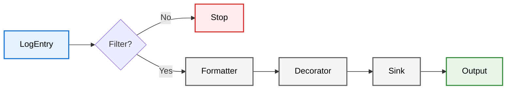
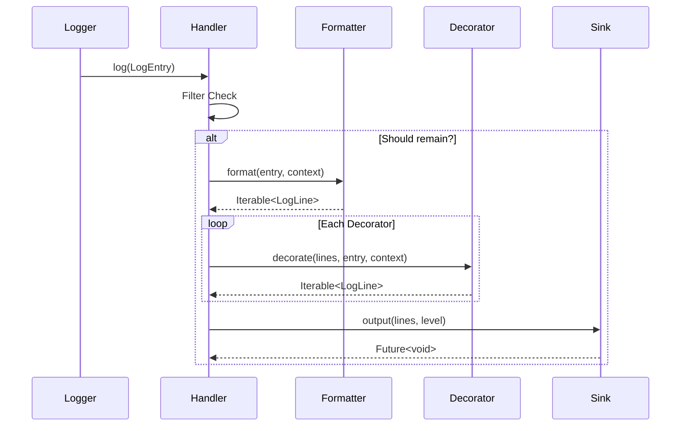
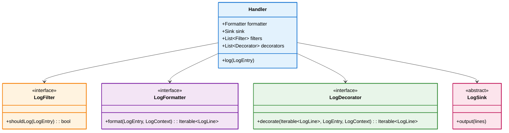

# Handler Architecture

This document details the internal processing pipeline of the `Handler` module.

## The Pipeline

The `Handler` class acts as an orchestrator. When `handler.log(entry)` is called, data flows through four distinct stages.

### The Life of a Log entry (Sequence)

### Operational Context (`LogContext`)

To avoid redundant calculations across the pipeline, the `Handler` initializes a `LogContext` object for every log entry. This context carries:
- **Available Width**: Calculated once based on `handler.lineLength` or `sink.preferredWidth`.
- **Metadata**: Temporary state required for formatters and decorators to remain stateless.

Formatters and decorators are strictly required to use `context.availableWidth` for all layout decisions (wrapping, padding, borders). This ensures that a decorator added at the end of the chain doesn't break the layout established by a formatter at the start.

### Stage 1: Filtering
**Component**: `LogFilter`
**Input**: `LogEntry`
**Output**: `Boolean`

Filters are deeply efficient checks run before any string manipulation occurs. If any filter returns `false`, processing stops immediately to save CPU cycles.
- *Example*: `LevelFilter` (ignore DEBUG logs), `RegexFilter` (ignore logs containing "password").

### Stage 2: Formatting
**Component**: `LogFormatter`
**Data Interface**: `LogField`
**Input**: `LogEntry`, `LogContext`
**Output**: `Iterable<LogLine>`
 
The formatter transforms the structured log entry into a list of semantic lines (`LogLine`). To ensure consistency, all formatters use the `LogField` system for field-safe data extraction from `LogEntry`.

- **Layout Alignment**: Formatters strictly rely on `context.availableWidth` provided by the handler to perform internal wrapping and alignment.
- **StructuredFormatter**: Detailed layout (header, origin, message) with fine-grained semantic tagging. **(Preferred for human reading)**
- **ToonFormatter**: Token-Oriented Object Notation. Highly efficient for LLM consumption. **(Preferred for AI agents)**
- **JsonFormatter**: Compact JSON serialization. Supports field customization via `LogField`.
- **JsonPrettyFormatter**: Pretty-printed JSON with semantic tagging.
- **MarkdownFormatter**: Generates structured Markdown output.
- **HTMLFormatter**: Produces semantic HTML segments.
- **PlainFormatter**: Standard `[timestamp] level: message` format.

### Semantic Tagging (`LogTag`)

The bridge between Stage 2 (Formatting) and Stage 3 (Decoration) is the `LogTag`. Formatters do not emit raw strings; they emit `LogSegment`s tagged with semantic metadata.

| Tag | Purpose | Example Component |
|---|---|---|
| `header` | General structural metadata | `ToonFormatter` keys |
| `timestamp` | Time of entry | `StructuredFormatter` |
| `level` | Log severity (e.g. `[INFO]`) | `StructuredFormatter` |
| `message` | The primary content | `JsonFormatter` |
| `border` | Visual framing characters | `BoxDecorator`, `JsonPrettyFormatter` |
| `origin` | File/Line source info | `StructuredFormatter` |
| `error` | Exception details | `LogField.error` extraction |
| `hierarchy` | Tree prefixes | `HierarchyDepthPrefixDecorator` |

**Why this matters**: A decorator can selectively target segments. For example, `StyleDecorator` might make `border` segments dim while making `level` segments bold and colored. This decoupling allows you to swap formatters without losing your high-fidelity terminal styling.

### Stage 3: Decoration
**Component**: `LogDecorator`
**Input**: `Iterable<LogLine>`
**Output**: `Iterable<LogLine>`

Decorators apply post-formatting transformations, often leveraging `LogContext.availableWidth` for dynamic adjustments. They are composable and execute in the order they appear in the `decorators` list (auto-sorted by type).
- **BoxDecorator**: Adds ASCII borders around the lines. It is now decoupled from the layout logic.
- **StyleDecorator**: The primary engine for visual transformations. Unlike simple colorizers, it:
    - Resolves semantic **LogStyles** from a **LogTheme** using both the `LogLevel` and the segment's `LogTag`s.
    - Supports bold, dim, italic, inverse, and both foreground/background colors.
    - **Merges styles**: It respects styles already applied by formatters while applying theme defaults.
    - Replaces the legacy **ColorDecorator** (now a deprecated alias).

For a deep dive into how decorators interact, see [Decorator Composition](decorator_compositions.md).

### Stage 4: Output (Sinking)
**Component**: `LogSink`
**Input**: `Iterable<LogLine>`, `LogLevel`
**Output**: `Future<void>` (I/O Side Effect)
 
The sink handles the physical write operation. Sinks are designed to be robust and isolated from the main application flow.

- **Preferred Width**: Each sink reports its `preferredWidth` (e.g., terminal width or default 80). The `Handler` uses this to initialize `LogContext.availableWidth` if a manual `lineLength` is not provided.
- **Fail-Safe Processing**: Sinks are wrapped in internal error handlers. If a `FileSink` fails (e.g., Disk Full), the error is routed to `InternalLogger` and does not crash the calling thread.
- **Concurrency**: Most sinks (except simple console wrappers) utilize an internal task queue (mutex) to serialize writes, preventing race conditions during rapid logging.

## Class Diagram

## Standard Implementations

### Sinks
- **ConsoleSink**: 
  - Dynamic width detection via `stdout.terminalColumns`.
  - Platform-aware ANSI support detection.
  - Efficiently translates `LogStyle` metadata into ANSI escape codes.
- **FileSink**: 
  - **Thread-Safety**: Uses a `_writeLock` (Completer-based mutex) to ensure sequential file access across asynchronous calls.
  - **Rotation**: Supports `SizeRotation` and `TimeRotation`. Handles file shifts, compression (GZip), and cleanup of old backups.
  - **Durability**: Employs `flush: true` on every write to minimize data loss during crashes.
  - **Auto-Provisioning**: Automatically creates parent directories if they don't exist.
- **HTMLSink**: 
  - Self-contained documents with embedded CSS for high-fidelity viewing in browsers.
  - Session-managed: Safely coordinates multiple sink instances writing to the same file path.
  - Dark mode support built-in.
- **MultiSink**: 
  - **Broadcast Engine**: Dispatches logs to child sinks in parallel using `Future.wait`.
  - **Error Isolation**: Failure in one child sink (e.g., a network timeout) does not prevent other sinks from completing.

### Threading & Safety
- **Isolate Awareness**: `logd` is designed to be safe across multiple isolates, though most sinks (like `FileSink`) perform their own synchronization to prevent file locking conflicts.
- **Async Boundary**: While formatting and decoration are synchronous for deterministic snapshotting of data, the `Sink.output` call is the async boundary. This allows the application to continue while the I/O system persists the logs.
