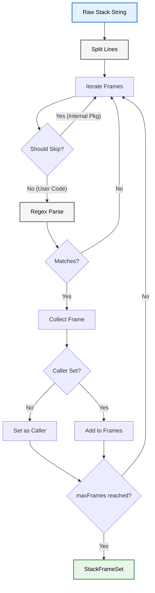

# Stack Trace Architecture

This document provides a technical overview of the stack_trace module implementation. It is intended for contributors and developers requiring a deeper understanding of the internal mechanics.

## File Structure

The stack_trace module is organized into 4 files:

| File | Lines | Purpose |
|------|-------|---------|
| [`stack_trace.dart`](../../lib/src/stack_trace/stack_trace.dart) | 9 | Part file aggregator |
| [`callback_info.dart`](../../lib/src/stack_trace/callback_info.dart) | 52 | Immutable data class for parsed frame information |
| [`stack_frame_set.dart`](../../lib/src/stack_trace/stack_frame_set.dart) | 20 | Immutable result container for single-pass parsing |
| [`stack_trace_parser.dart`](../../lib/src/stack_trace/stack_trace_parser.dart) | 116 | Core parsing engine with regex-based frame extraction |

## System Components

The stack_trace module consists of three primary components:
1. **The Parser**: Regex-based extraction engine
2. **The Result Model**: Immutable parse result (`StackFrameSet`)
3. **The Data Model**: Immutable frame representation (`CallbackInfo`)

### 1. StackTraceParser

**Location**: `StackTraceParser` class in [`stack_trace_parser.dart`](../../lib/src/stack_trace/stack_trace_parser.dart)

The parser is the core engine that converts raw stack trace strings into structured `CallbackInfo` objects.

**Configuration**:
- `ignorePackages` - List of package prefixes to skip (e.g., `['logd', 'flutter']`)
- `customFilter` - Optional callback for custom filtering logic

**Immutability**: The parser is marked `@immutable` and uses `const` constructor, making it safe to share across isolates.

### 2. StackFrameSet

**Location**: `StackFrameSet` class in [`stack_frame_set.dart`](../../lib/src/stack_trace/stack_frame_set.dart)

An immutable result container returned by `StackTraceParser.parse()`.

**Fields**:
- `caller` - First relevant `CallbackInfo` (nullable)
- `frames` - List of additional `CallbackInfo` frames (may be empty)

### 3. CallbackInfo

**Location**: `CallbackInfo` class in [`callback_info.dart`](../../lib/src/stack_trace/callback_info.dart)

An immutable data class representing a single parsed stack frame.

**Fields**:
- `className` - Extracted class name (empty string for top-level functions)
- `methodName` - Method or function name
- `filePath` - File URI from the stack frame
- `lineNumber` - Line number as integer
- `fullMethod` - Complete method string (e.g., `'Class.method'`)

**Immutability**: Marked `@immutable` with all fields `final`, implements proper `==` and `hashCode`.

## Parsing Pipeline

When `parse()` is called, the raw stack trace string is processed linearly:



### Extraction Algorithm

**Location**: `StackTraceParser.parse()` in [`stack_trace_parser.dart`](../../lib/src/stack_trace/stack_trace_parser.dart)

```dart
StackFrameSet parse({
  required StackTrace stackTrace,
  int skipFrames = 0,
  int maxFrames = 0,
}) {
  final lines = stackTrace.toString().split('\n');
  CallbackInfo? caller;
  final frames = <CallbackInfo>[];
  int index = skipFrames;

  while (index < lines.length) {
    final frame = lines[index].trim();
    index++;
    if (frame.isEmpty) continue;
    if (_shouldIgnoreFrame(frame)) continue;

    final info = _parseFrame(frame);
    if (info == null) continue;

    caller ??= info;  // First valid frame becomes the caller
    if (maxFrames > 0 && frames.length < maxFrames) {
      frames.add(info);
    }
    if (maxFrames == 0 || frames.length >= maxFrames) {
      break;  // Early exit once we have what we need
    }
  }

  return StackFrameSet(caller: caller, frames: frames);
}
```

**Key Characteristics**:
1. **Single pass** - Extracts both caller and frames in one iteration
2. **Early exit** - Returns immediately upon collecting enough frames
3. **Defensive** - Returns null caller if no valid frame found, never throws

### Frame Filtering

**Location**: `StackTraceParser._shouldIgnoreFrame()` in [`stack_trace_parser.dart`](../../lib/src/stack_trace/stack_trace_parser.dart)

Frames are skipped if:
1. **Custom filter rejects** - `customFilter` returns `false`
2. **Package match** - Frame contains `package:<pkg>/` where `<pkg>` is in `ignorePackages`

```dart
bool _shouldIgnoreFrame(String frame) {
  if (customFilter != null && !customFilter!(frame)) {
    return true;
  }
  return ignorePackages.any((pkg) => frame.contains('package:$pkg/'));
}
```

### Frame Parsing

**Location**: `StackTraceParser._parseFrame()` (private) in [`stack_trace_parser.dart`](../../lib/src/stack_trace/stack_trace_parser.dart)

**Dart VM Stack Format**:
```
#<id>  <function> (<fileUri>:<line>:<column>)
```

**Example**:
```
#0 MyClass.myMethod (package:myapp/service.dart:42:7)
```

**Regex Pattern**:
```dart
static final _frameRegex = RegExp(r'#\d+\s+(.+)\s+\((.+):(\d+)(?::\d+)?\)');
```

**Capture Groups**:
- Group 1: Function name (`MyClass.myMethod`)
- Group 2: File URI (`package:myapp/service.dart`)
- Group 3: Line number (`42`)
- Group 4: Column number (optional, currently ignored)

**Class/Method Extraction**:
```dart
final fullMethod = match.group(1)!;
final dotIndex = fullMethod.lastIndexOf('.');

final className = dotIndex != -1 
    ? fullMethod.substring(0, dotIndex) 
    : '';
    
final methodName = dotIndex != -1 
    ? fullMethod.substring(dotIndex + 1) 
    : fullMethod;
```

**Leading Underscore Removal**:
```dart
className: className.replaceFirst(RegExp('^_'), ''),
```
Private class names (e.g., `_MyClass`) have the leading underscore stripped for cleaner output.

## Performance Characteristics

### Time Complexity
- **parse()**: O(n) where n = number of frames until enough are collected
- **_parseFrame()**: O(1) - Single regex match
- **Best case**: O(1) - First frame matches
- **Worst case**: O(n) - No frames match, scan entire trace

### Space Complexity
- **O(n)** for string splitting (creates array of lines)
- **O(1)** for regex matching (no additional allocations)

### Optimizations
1. **Early exit** - Stops as soon as caller + maxFrames collected
2. **Regex caching** - `static final _frameRegex` compiled once per class load, not per call
3. **Single-pass parsing** - `parse()` extracts both caller and frames in one pass
4. **No frame caching** - Stack traces are unique per call, caching would waste memory
5. **Immutable results** - `CallbackInfo` can be safely shared without copying

## Edge Cases

### Empty Stack Traces
```dart
final result = parser.parse(stackTrace: StackTrace.fromString(''));
// result.caller: null
// result.frames: []
```

### Malformed Frames
Malformed frames are silently skipped. If regex matching fails, `_parseFrame()` returns `null` and the parser continues to the next frame.

### All Frames Filtered
```dart
final parser = StackTraceParser(ignorePackages: ['myapp']);
final result = parser.parse(stackTrace: myAppStackTrace);
// result.caller: null (all frames belong to 'myapp')
```

### Anonymous Functions
```dart
#0 <anonymous closure> (file.dart:10:5)
```
Parsed as:
- `className`: empty string
- `methodName`: `'<anonymous closure>'`

## Platform Differences

### Dart VM (Current Support)
Format: `#0 Class.method (package:app/file.dart:10:5)`
- ✅ Fully supported

### Dart Web (Not Yet Supported)
Formats vary by browser:
- Chrome: `at Function (http://localhost/main.dart.js:1234:56)`
- Firefox: `function@http://localhost/main.dart.js:1234:56`
- ❌ Not currently supported (see roadmap)

### Flutter AOT (Obfuscated)
Format: `#0 a.b (file.dart:10:5)`
- ⚠️ Parses successfully but names are mangled
- Requires symbol map for deobfuscation (see roadmap)

## Integration with Logger Module

The logger module uses `StackTraceParser.parse()` for single-pass extraction of both caller and stack frames:

**Location**: `Logger._log()` in logger module

```dart
final frameCount = stackMethodCount[level] ?? 0;
final parsed = stackTraceParser.parse(
  stackTrace: stackTrace ?? StackTrace.current,
  skipFrames: 1,  // Skip Logger._log itself
  maxFrames: frameCount,
);
if (parsed.caller == null) return;

final entry = LogEntry(
  origin: _buildOrigin(parsed.caller!),
  stackFrames: parsed.frames.isEmpty ? null : parsed.frames,
  // ...
);
```

## Equality and Hashing

Both `StackTraceParser` and `CallbackInfo` implement proper equality:

**StackTraceParser**:
```dart
bool operator ==(Object other) =>
    identical(this, other) ||
    other is StackTraceParser &&
    listEquals(ignorePackages, other.ignorePackages) &&
    customFilter == other.customFilter;
```

**CallbackInfo**:
```dart
bool operator ==(Object other) =>
    identical(this, other) ||
    other is CallbackInfo &&
    className == other.className &&
    methodName == other.methodName &&
    filePath == other.filePath &&
    lineNumber == other.lineNumber &&
    fullMethod == other.fullMethod;
```

This enables proper comparison in tests and cache keys.
