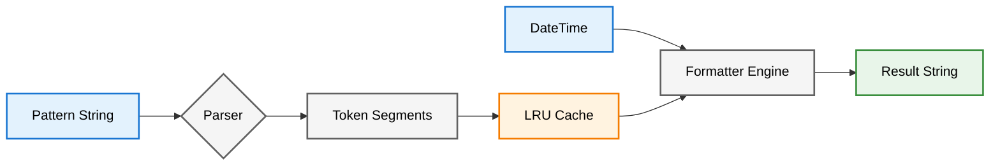
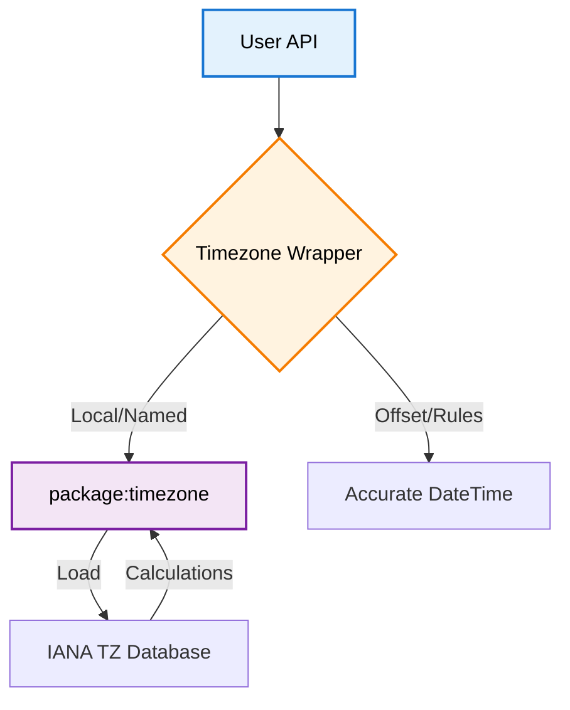

# Time Architecture

The Time module implements a custom formatting engine and a standalone timezone calculator.

## Formatting Engine

Instead of `SimpleDateFormat` or `intl`, `logd` uses a custom `TimestampFormatter` optimized for speed and caching.

### Components
1.  **FormatSegment**: Represents either a literal (e.g., `T`, `:`) or a Token (e.g., `yyyy`, `SSS`).
2.  **TimestampFormatterCache**: An LRU-style cache (size 50) that stores parsed segments. This ensures that creating `Timestamp` objects is cheap, as parsing happens only once per pattern.
3.  **Replacements Map**: A fast lookup table generated per `format()` call mapping tokens (`yyyy`) to values (`2025`).

## Timezone Engine

The `Timezone` class serves as a wrapper around the standard **IANA Time Zone Database**, provided by the `timezone` package.

### Architecture

### Components

1.  **Timezone Wrapper**: The `logd` `Timezone` class provides a unified API (`local`, `utc`, `named`) that abstracts the underlying library.
2.  **Initialization**: `Timezone.ensureInitialized()` loads the IANA database (bundled with the package). This is handled implicitly by `local()` and `named()` factories if not done manually.
3.  **Local Resolution**: 
    - `Timezone.local()` attempts to match the system's timezone name against the IANA database.
    - If the name is unknown (e.g., on some minimal Android environments), it falls back to a **Fixed Offset** timezone derived from the system's current offset, ensuring application stability even if DST rules are unavailable.

