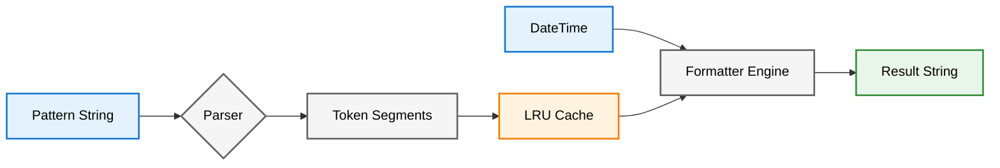
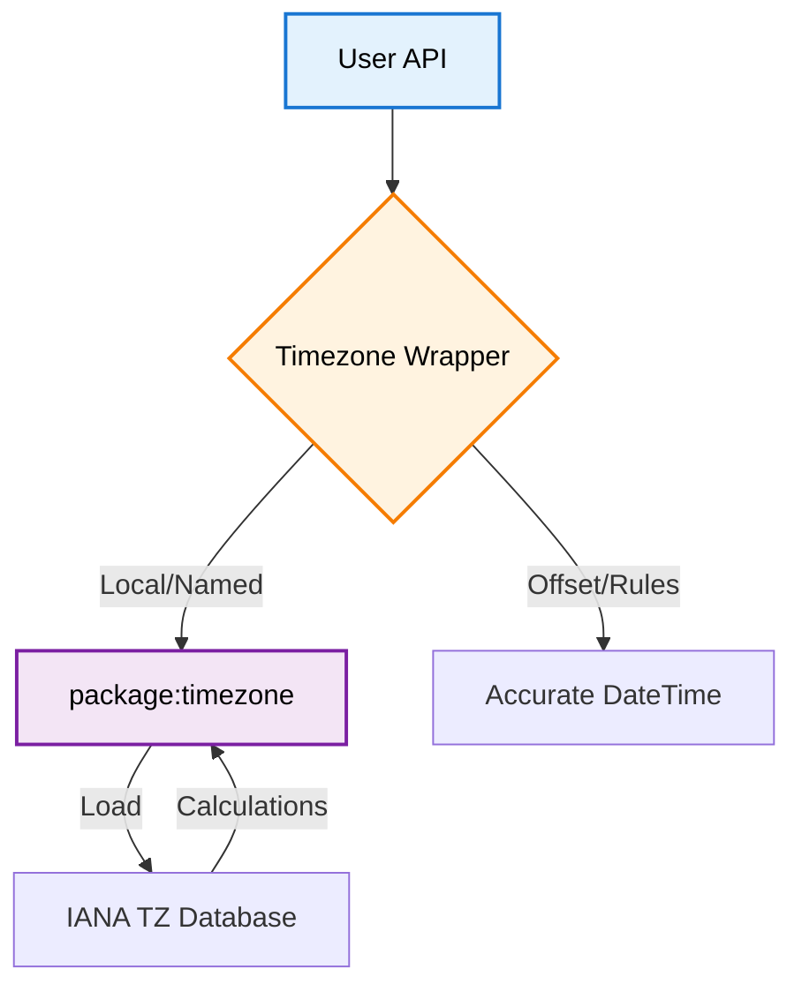

# Time Architecture

The Time module implements a custom formatting engine and a standalone timezone calculator.

## Formatting Engine

Instead of `SimpleDateFormat` or `intl`, `logd` uses a custom `TimestampFormatter` optimized for speed and caching.


```mermaid
graph LR
    String[Pattern String] --> Parser{Parser}
    Parser --> Segments[Token Segments]
    Segments --> Cache[LRU Cache]
    DateTime[DateTime] --> Engine[Formatter Engine]
    Cache --> Engine
    Engine --> StringOut[Result String]
    
    classDef inputStyle fill:#e3f2fd,stroke:#1976d2,stroke-width:2px,color:#000
    classDef cacheStyle fill:#fff3e0,stroke:#f57c00,stroke-width:2px,color:#000
    classDef processStyle fill:#f5f5f5,stroke:#616161,stroke-width:2px,color:#000
    classDef outputStyle fill:#e8f5e9,stroke:#388e3c,stroke-width:2px,color:#000
    
    class String,DateTime inputStyle
    class Cache cacheStyle
    class Parser,Segments,Engine processStyle
    class StringOut outputStyle
```

### Components
1.  **FormatSegment**: Represents either a literal (e.g., `T`, `:`) or a Token (e.g., `yyyy`, `SSS`).
2.  **TimestampFormatterCache**: An LRU-style cache (size 50) that stores parsed segments. This ensures that creating `Timestamp` objects is cheap, as parsing happens only once per unique pattern string.
3.  **Replacements Map**: A fast lookup table generated per `format()` call mapping tokens (`yyyy`) to values (`2025`).

### Date-Only Formatting

`Timestamp` provides a `dateOnly` factory constructor for cases where only the date portion is needed (e.g., log file naming, daily rotation):

```dart
final ts = Timestamp.dateOnly(); // Default: 'yyyy.MMM.dd'
final ts = Timestamp.dateOnly(formatter: 'yyyy-MM-dd'); // Custom pattern
```

This is equivalent to `Timestamp(formatter: 'yyyy.MMM.dd', ...)` but communicates intent clearly and avoids clock/timezone overhead when only a date label is needed.

## Timezone Engine

The `Timezone` class serves as a wrapper around the standard **IANA Time Zone Database**, provided by the `timezone` package.

### Architecture


```mermaid
graph TD
    User[User API] --> Timezone{Timezone Wrapper}
    Timezone -->|Local/Named| TZPkg[package:timezone]
    TZPkg -->|Load| Database[IANA TZ Database]
    Database -->|Calculations| TZPkg
    Timezone -->|Offset/Rules| Result[Accurate DateTime]
    
    style User fill:#e3f2fd,stroke:#1976d2,stroke-width:2px,color:#000
    style Timezone fill:#fff3e0,stroke:#f57c00,stroke-width:2px,color:#000
    style TZPkg fill:#f3e5f5,stroke:#7b1fa2,stroke-width:2px,color:#000
```

### Components

1.  **Timezone Wrapper**: The `logd` `Timezone` class provides a unified API (`local`, `utc`, `named`) that abstracts the underlying library.
2.  **Initialization**: `Timezone.ensureInitialized()` loads the IANA database (bundled with the package). This is handled implicitly by `local()` and `named()` factories if not done manually.
3.  **Local Resolution**: 
    - `Timezone.local()` attempts to match the system's timezone name against the IANA database.
    - **Windows Compatibility**: On Windows, system timezone names (e.g., `'Iran Standard Time'`) are mapped to their standard IANA identifiers (e.g., `'Asia/Tehran'`) using an internal Unicode CLDR mapping table before querying the IANA database.
    - If the name remains unknown (e.g., on some minimal Android environments or custom systems), it falls back to a **Fixed Offset** timezone derived from the system's current offset, ensuring application stability even if DST rules are unavailable.

### Timezone Offset Cache

Computing `tz.TZDateTime.from(utcNow, location).timeZoneOffset` on every log call is too expensive for high-throughput workloads. `Timezone.offset` caches the result with 1-minute granularity:

```dart
static int _cachedMinute = 0;
static final Map<String, Duration> _cachedOffsets = {};

Duration get offset {
  final minuteKey = utcNow.millisecondsSinceEpoch ~/ 60000;
  if (minuteKey == _cachedMinute) {
    final cached = _cachedOffsets[name];
    if (cached != null) return cached; // cache hit
  } else {
    _cachedMinute = minuteKey;
    _cachedOffsets.clear(); // invalidate all on minute boundary
  }
  // recompute and store
  final duration = tz.TZDateTime.from(utcNow, _location).timeZoneOffset;
  _cachedOffsets[name] = duration;
  return duration;
}
```

**Design rationale**:
- **1-minute key** — DST transitions are always on clock boundaries (typically hour boundaries), so 1-minute precision never misses a DST switch.
- **Map keyed by timezone name** — Multiple `Timezone` instances for different zones share the same cache structure. A single `_cachedMinute` guards all of them: on a minute boundary, all entries are evicted together.
- **Isolate-local statics** — Cache state does not cross isolate boundaries.
