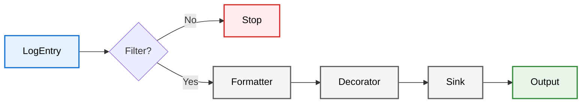
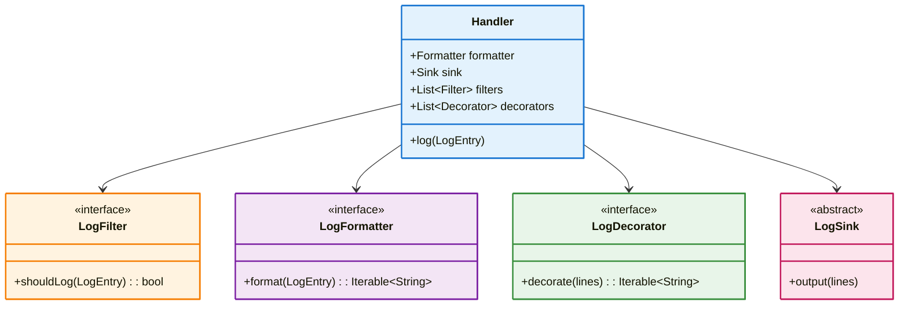

# Handler Architecture

This document details the internal processing pipeline of the `Handler` module.

## The Pipeline

The `Handler` class acts as an orchestrator. When `handler.log(entry)` is called, data flows through four distinct stages.

### Stage 1: Filtering
**Component**: `LogFilter`
**Input**: `LogEntry`
**Output**: `Boolean`

Filters are deeply efficient checks run before any string manipulation occurs. If any filter returns `false`, processing stops immediately to save CPU cycles.
- *Example*: `LevelFilter` (ignore DEBUG logs), `RegexFilter` (ignore logs containing "password").

### Stage 2: Formatting
**Component**: `LogFormatter`
**Input**: `LogEntry`
**Output**: `Iterable<String>`

The formatter transforms the structured log entry into a list of strings.
- **BoxFormatter**: Draws ASCII borders around the message.
- **JsonFormatter**: precise JSON serialization.
- **PlainFormatter**: Standard `[timestamp] level: message` format.

### Stage 3: Decoration
**Component**: `LogDecorator`
**Input**: `Iterable<String>`
**Output**: `Iterable<String>`

Decorators apply post-formatting transformations. This is commonly used for terminal coloring, where ANSI codes are injected around specific lines based on the log level.

### Stage 4: Output (Sinking)
**Component**: `LogSink`
**Input**: `Iterable<String>`
**Output**: `Future<void>` (I/O Side Effect)

The sink handles the physical write operation. Sinks are designed to be non-blocking where possible.
- **ConsoleSink**: Wraps `print` / `stdout`.
- **FileSink**: Manages file streams, locking, and rotation.

## Class Diagram

## Standard Implementations

### Sinks
- **FileSink**: Supports `SizeRotation` (rotate after 10MB) and `TimeRotation` (rotate daily). Uses platform-specific file locking.
- **MultiSink**: A composite sink that broadcasts to multiple children (e.g., Write to File AND Console concurrently).

### Threading & Safety
Handlers operate synchronously for Formatting and Decoration to ensure data consistency, but Sinks are typically asynchronous (`Future<void>`) to perform I/O without blocking the UI isolate.
