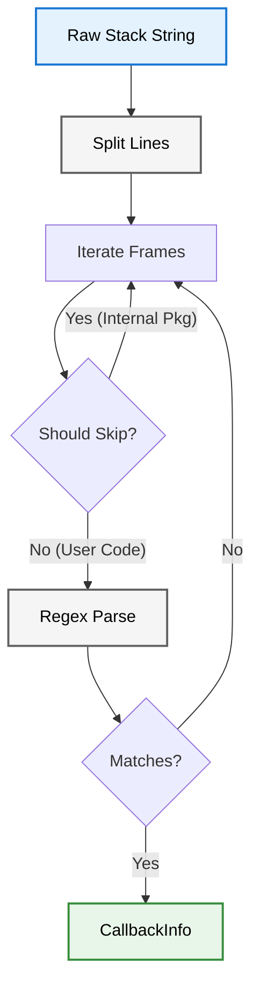

# Stack Trace Architecture

The module uses a regex-based parser to extract structured data from raw string stack traces.

## Parsing Pipeline

When `extractCaller()` is called, the raw stack trace string is processed linearly.

### Components

#### 1. StackTraceParser
The core engine. It accepts a `StackTrace` object and configuration:
- `skipFrames`: Initial offset (to ignore `Logger` internals).
- `ignorePackages`: List of package names (e.g., `flutter`, `logd`) to automatically skip.

#### 2. Frame Parsing Logic
It assumes the standard Dart VM stack format:
`#id  Function (fileUri:line:col)`

**Regex**: `#\d+\s+(.+)\s+\((.+):(\d+)(?::\d+)?\)`
- Group 1: Function name (`Class.method` or `function`)
- Group 2: File URI
- Group 3: Line number

### Filtering Strategy
To find the "Caller", the parser doesn't just take the top frame. It iterates down:
1. Skip `skipFrames` count.
2. Check if frame is empty/malformed -> Skip.
3. Check `ignorePackages`. If frame belongs to `package:logd/...` -> Skip.
4. Check `customFilter`. If user logic says skip -> Skip.
5. First frame to survive these checks is returned as the `CallbackInfo`.

## Performance
Parsing stack traces is relatively expensive (String splitting + Regex).
- **Optimization**: We only parse until the *first* valid frame is found. We do not process the entire trace unless necessary.
- **Cache**: `logd` does not currently cache stack trace parsing results as they are unique per call.
