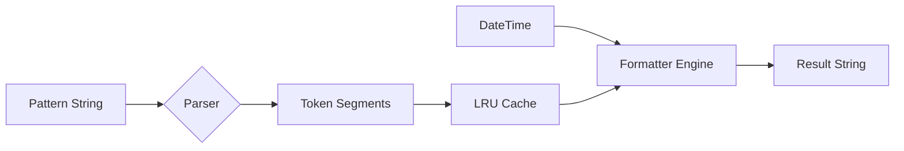
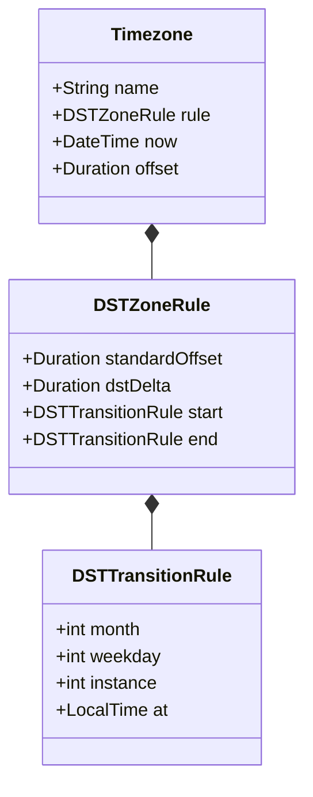

# Time Architecture

The Time module implements a custom formatting engine and a standalone timezone calculator.

## Formatting Engine

Instead of `SimpleDateFormat` or `intl`, `logd` uses a custom `TimestampFormatter` optimized for speed and caching.

### Components
1.  **FormatSegment**: Represents either a literal (e.g., `T`, `:`) or a Token (e.g., `yyyy`, `SSS`).
2.  **TimestampFormatterCache**: An LRU-style cache (size 50) that stores parsed segments. This ensures that creating `Timestamp` objects is cheap, as parsing happens only once per pattern.
3.  **Replacements Map**: A fast lookup table generated per `format()` call mapping tokens (`yyyy`) to values (`2025`).

## Timezone Engine

The `Timezone` class allows creating instances that are aware of Daylight Saving Time (DST) transitions without relying on the OS's `tzdata`.

### DST Logic
The engine uses `DSTZoneRule` to calculate offsets.
- **Rules**: Defined by a Start Month/Week/Day and End Month/Week/Day.
- **Transition Calculation**: `_computeTransition` dynamically finds the exact UTC instant a clock change occurs for a given year.
- **Offset Computation**: For any given UTC `DateTime`, the engine checks:
    1. Is the time within the Start/End window? (Northern Hemisphere)
    2. OR does it wrap around the year end? (Southern Hemisphere)

### Local Resolution
`Timezone.local()` attempts to match the system's timezone name (e.g., "America/New_York") against a built-in map of known rules. If unknown, it falls back to a **Fixed Offset** timezone based on the current system settings, logging a warning that DST automatic transitions will not be supported for that unknown zone.
